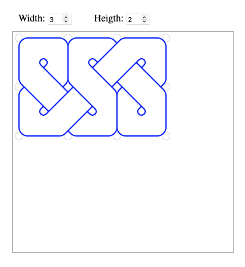

# Celtic

Draw Celtic knots by placing walls on a grid.

Directly inspired by WelshPixie’s [guide on how fae draw Celtic knots](https://mastodon.art/@welshpixie/112496027266636193).

Try it [here](https://ithink.ch/olivier/celtic/).



## Building

It’s over-engineered, as it’s based on another project of mine that is a port of some Java applets I wrote in 2000. It’s written in TypeScript and built using a `node:18` docker image.

After cloning the repository or unpacking the source archive, run `make init` to install the dependencies (that’s just TypeScript for now.) Then build with `make`.

If you don’t want to use Docker and have node installed on your machine, you can probably just replace the first line of the `Makefile`:

```
NODE = docker run -it -w /home/node -v $$(pwd):/home/node --rm node:18
```

with

```
NODE = /path/to/node
```

and it should build fine. Otherwise, open an issue and I’ll try and help.
